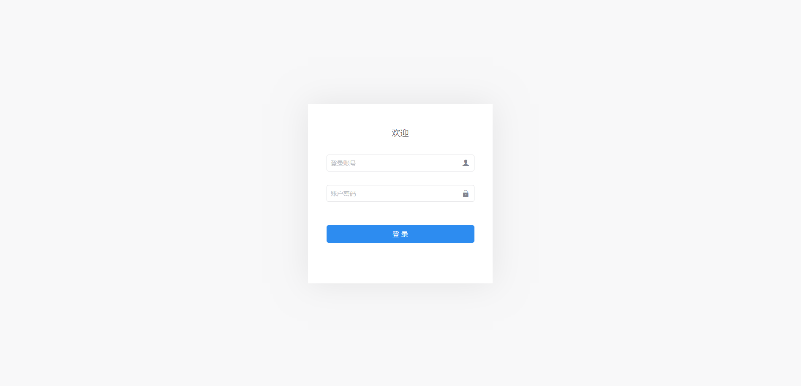
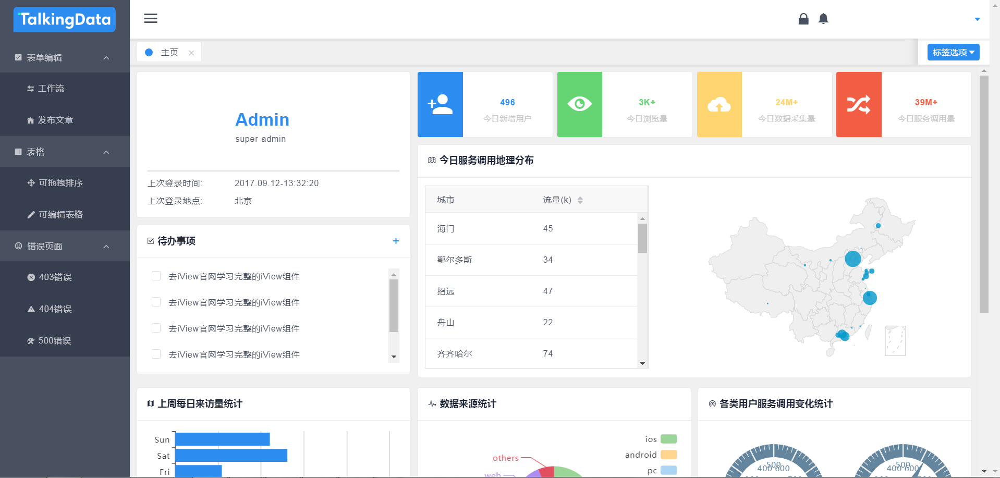
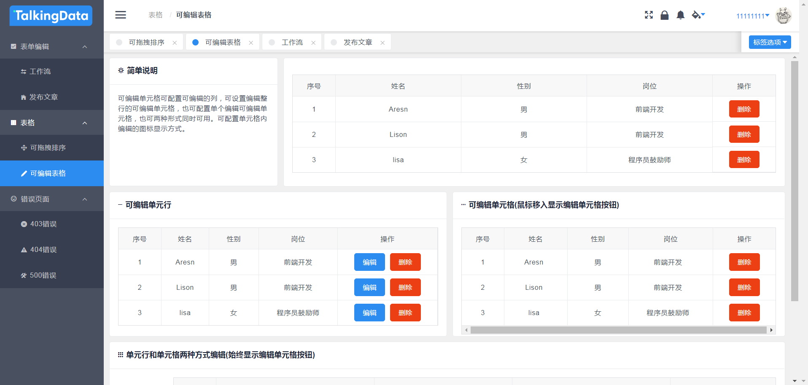
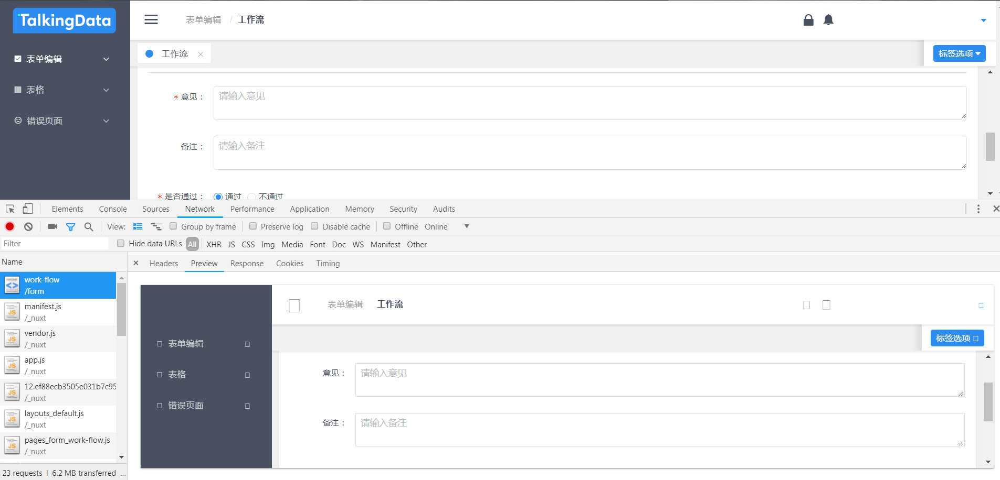

# nuxt-demo

> 最近公司CRM项目采用 nuxt+ivew+iview-admin+koa2的组合模式开发，目前正在踩坑中，demo还不完整，后面会继续更新

## Build Setup

``` bash
# install dependencies
$ npm install # Or yarn install

# serve with hot reload at localhost:3000
$ npm run dev

```


参考资料

[Nuxt.js docs](https://github.com/nuxt/nuxt.js)

[iview docs](https://www.iviewui.com/docs/guide/install)

[iview-admin](https://github.com/iview/iview-admin)

相关页面效果

截图一： 账号和密码随意填写



截图二：



截图三：



刷新浏览器，重新从服务器端获取页面，看到是已经渲染过的html


